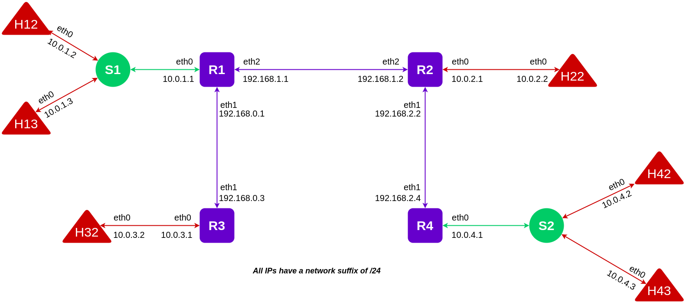

# Assignment 2 - Routing Logic (IP Forwarding Mechanism) in Mininet

## Problem Statement

_[View problem statement](./Assignment-2.pdf)_

## Reports

Read the report _[here](./Report.pdf)_ or  on _[Notion](https://shathin.notion.site/NC864-SDN-Assignment-2-0c6d4cdd7d5f4879ae14a2806014828c)_.

## Target Network



The above diagram shows the target networks with the additional neccessary assumptions made based on the target network shown in the problem statement. 

Following are the different subnets and hosts in those networks - 

- $10.0.1.0/24$ → $R1-eth0$, $H12$, $H13$ and $S1$.
- $10.0.2.0/24$ → $R2-eth0$ and $H22$
- $10.0.3.0/24$ → $R3-eth0$ and $H32$
- $10.0.4.0/24$ → $R4-eth0$, $H42$, $H43$ and $S2$.
- $192.168.0.0/24$ → $R1-eth1$ and $R3-eth1$
- $192.168.1.0/24$ → $R1-eth2$ and $R2-eth2$
- $192.168.2.0/24$ → $R2-eth1$ and $R4-eth1$

## Scripts

Two scripts are available for execution `assignment2_routing1.py` and `assignment2_routing2.py`.

```bash
sudo python3 script.py
```

Both the scripts create the same target network but differ in the connectivity provided for the hosts in the network.

### `assignment2_routing1.py`

This scripts creates the target network and allows all hosts $H12$. $H13$. $H22$, $H32$, $H42$ and $H43$ to be able to ping each other.

### `assignment2_routing2.py`

This script creates the target network and allows hosts $H12$. $H13$. $H22$, $H32$, $H42$ and $H43$ to be able to ping each other with the exception of $H12$ being able to ping $H22$ (and vice-versa).


Be sure to clean up before executing the script for another time. Run `sudo mn -c` command to perform the cleanup.