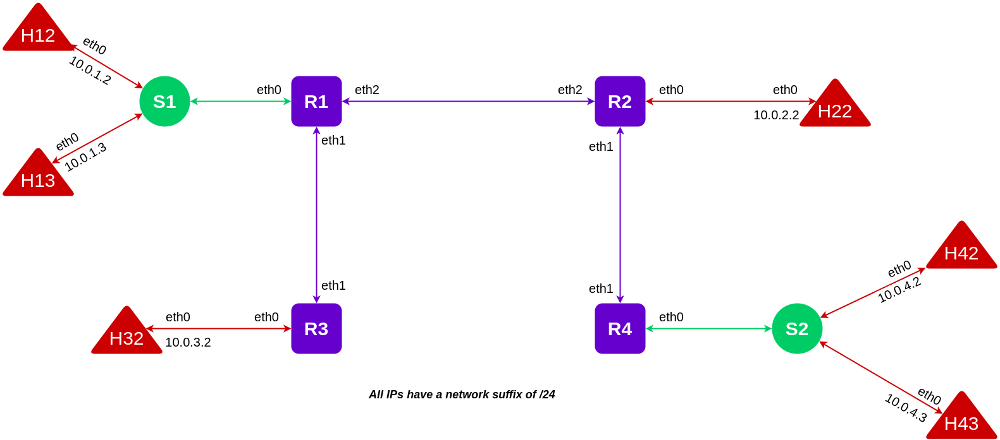

# Assignment 3 - Routing in Mininet using SDN

## Problem Statement
_[View problem statement](./NC864_Assignment-3.pdf)_

## Report

Read the report _[here](./Report.pdf)_ or  on _[Notion](https://shathin.notion.site/NC864-SDN-Assignment-3-efe75398d6104c7eb3cf923e49919772)_.

## Target Network



The above diagram shows the target network.

Following are the different subnets and hosts in those networks - 

- $10.0.1.0/24$ → $R1-eth0$, $H12$, $H13$ and $S1$.
- $10.0.2.0/24$ → $R2-eth0$ and $H22$
- $10.0.3.0/24$ → $R3-eth0$ and $H32$
- $10.0.4.0/24$ → $R4-eth0$, $H42$, $H43$ and $S2$.

# The Script

The `assignment3_topo.py` python script creates the above target network using the Python Mininet API. 

The `DefaultController` ([**OVS Test Controller**](http://www.openvswitch.org/support/dist-docs/ovs-testcontroller.8.txt)) was used in place of ODL (as required by the problem statement) as ODL was causing problems by showing various unexpected behaviours. The `DefaultController` does perform all the required actions like automatically installing flow rules when necessary. 

The script can be run as follows - 

```bash
sudo python3 assignment3_topo.py
```

Be sure to clean up before executing the script for another time. Run `sudo mn -c` command to perform the cleanup.

---